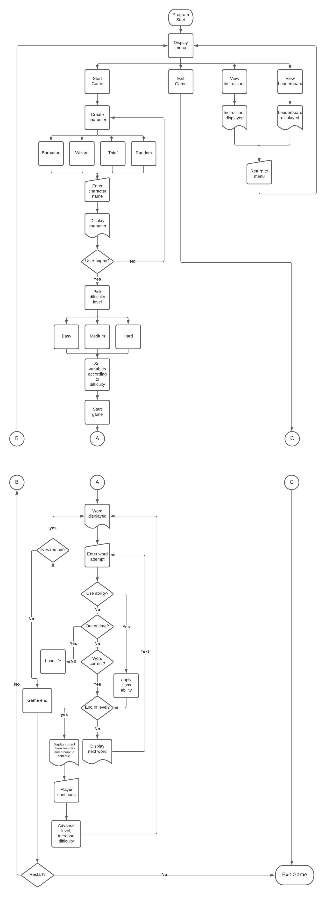

# **SOFTWARE DEVELOPMENT PLAN**

## **PURPOSE AND SCOPE**

### A HIGH LEVEL EXPLANATION

As a long term gamer (without much time to play games anymore), I have dabbled in many genre of game. One of the hardest to make an enjoyable experience out of, I feel, is the “educational” game. Out of that genre, there has been one type of game that has always interested me, and that is the humble “spelling” game.

I have decided to make one of these, and design it in such a way that it gives a little flavour to what can be quite a dry subject. I have taken some of the mechanics of “Role Playing Games” and melded that with spelling as the core feature of the game.

### SOLVING WHAT PROBLEM?

I think that, with the introduction of technology into our world, there has been a decrease in the importance of our language and the proper use of it. Cursive writing is becoming a thing of the past, as is the reading of actual paper books. Spelling especially is falling by the wayside and people’s vocabulary is decreasing. THere is a whole world of words out there that are colourful and descriptive.

This game will gives users the opportunity to test their memories and more so their spelling. I have attempted to make it more interesting with the added “role playing” aspect.

### TARGET AUDIENCE

This app is aimed at all genders and all ages. We are never too old to learn and this app offers the choice of difficulty levels so that users can choose their own challenge. Not everyone will be aware of what a “role playing game” is, but we can all appreciate the value of words. 

### HOW WILL THEY USE IT

Players will be asked to create a character - either a wizard, barbarian or thief - and then will have to face the enemy with the task of defeating hordes of ever increasing difficulty.

The enemy “hordes” will take the form of a group of words. The player will be presented with a word on screen for a given amount of time (this is dependent on the difficulty level chosen and which level of the game they are on). They then have a limited time to input the word correctly in order to progress. If inputted incorrectly, they will lose a life (of which they only have a limited number). Once a set number of words have been inputted correctly, they will progress to the next level (or “wave”) of enemies, until they defeat the third and final wave and win the game.

There are “special abilities in the game’, some depending on the character class picked. For example, Barbarians generally have more lives (or “HP”) and have a “Big Strike” ability. All characters (possibly) have a pass ability (essentially allowing them to pass a word. 

Characters amass a score as they play, and the game stores these scores presenting them on a leaderboard.

## **FEATURES**

### CHARACTER CREATION

When the player starts the game, they will be asked to pick a class from a menu, either Barbarian, Wizard, Thief or random. If they pick from the first three, they will be asked to input a name. Once a valid name has been entered (this is checked by using a while loop, ensuring they enter some kind of input), their character will be created using a set of rules. The player is presented with their character and all their attributes, and are asked if they are happy or if they want to create again.

* Each character class (BarbarianClass, WizardClass and ThiefClass) inherits from a parent class (PlayerCharacter).

* PlayerCharacter stores attributes of each character such as name, character class and character traits. 

* Traits are randomised, but capped at 20 and floored at 5

* Individual class traits are then adjusted according to class rules. 

* As traits (intelligence, endurance and dexterity) are stored as a Hash, after traits are decided, a loop runs through the values to make sure none has exceeded the cap (or subceeded the floor) after adjustment.

* Character’s HP is determined by their Endurance trait

* Character’s amount of pass powers are determined by their intelligence.

* Furthermore, a method is established in each child class to create their special class abilities.

* Some of the instance variables are made readable, or readable AND writable, since events will decrease their HP (and possibly some of their other traits)

### DIFFICULTY LEVEL

Once the player has created a character, they have the opportunity to pick a difficulty level (easy, medium or hard). This customises the user experience to fit with their ability or required challenge level.

A case statement is used to adjust global variables in regards to the amount of time they are given to memorise the word and also the time they are given to enter their attempt.

### SPECIAL ABILITIES

Characters have special abilities:

* All characters - PASS ability: They have a determined amount depending on their intelligence score. It gives them the chance to pass a word but still defeat that particular enemy. They do this simply by pressing the enter button instead of typing any other input. They have to be careful, because if they have used up all their PASS powers, they will lose a life instead.

Specific character abilities (these are used by entering the digit "1" when making a word attempt)

* Barbarian - BIG STRIKE ability: By sacrificing 2 HP, the barbarian can automatically wipe out half of the current waves remaining enemies (words). They have to be careful, as if they don't have enough HP left they will automatically die.

* Wizard - SLOW TIME ability: By sacrificing intelligence points, they can increase the amount of time they have to look at the word before it is hidden. They have to remember that losing intelligence points might reduce the amount of passes they have (as no. of passes are determined by the intelligence score)

* Thief - SNEAKY PEEK ability: This is a one off power which a thief uses. When used, instead of having to type a word guess in, they will be presented with three words in the menu, one of which is the correct one. There is no real sacrifice in using this power so the Thief class is a little OP.

All of these methods will utilise some of the global variable scope, as they need some information from the main ruby file to determine outcomes.

### LEADERBOARD

Players are awarded scores by the speed at which they enter a correct answer. The character name and score total is saved to a YAML file at the end of the game. We avoid having to use a begin..rescue block here by using the "a+" mode when writing to the YAML file. It creates the file if it doesn't already exist.

The option to view this leaderboard is given in the main menu. We do have a Begin..rescue block when reading the YAML file in this instance as if this is the first time the game has been played, there will be no YAML file present to read. The user is given a notice that there are no high scores and they are the first to play the game.

## **USER INTERACTION AND EXPERIENCE**

The user will find out about how to interact with program features through the instruction file which is one of the initial menu choices. They are told on this page that if they haven't played before, they should read the instructions.

Apart from choosing the character name, all choices are given to the user by menu prompts (using TTY-Prompt). This ensures no errors will be thrown by mistyping. 

The special power features are used by typing a specific numerical character or by only pressing enter. The user is not likely to do this by mistake, especially since none of the words contain any numbers. 

When entering a name, if the user doesn't enter anything, they will be repeatedly asked to enter a valid name, until some string has been entered.

When a user attempts to look at the leaderboard when there have not yet been any scores collected, they will be told that they are the first to play the game, and that there are no scores to show. (Under the hood, this is because a highscore YAML file has not yet been created.)

## **CONTROL FLOW**

## **IMPLEMENTATION PLAN**

[Trello Board](https://trello.com/b/AhqZv7GU/t1a3terminalapp)

## **HELP AND INSTALLATION**

To run this program you will need to ensure that you have ruby installed (see [Installing Ruby](https://www.ruby-lang.org/en/documentation/installation/#rubyinstaller) for your particular platform)

This application is running on Ruby version 2.7.2

This application was developed on the WSL:Ubuntu 18.04 platform

Clone the files from this Git Repository using SSH by running this command on the command line:

`git@github.com:mintyjones/T1A3_Terminal_App.git`

Make sure you are in the root directory fot the project, and run the following command:

`./script.sh`

You can add the following two arguments to this command to 

1. Personlaise the experience
2. Byoass the main menu and start a randomised game straight away

For example:

`./script.sh Gordon -s`